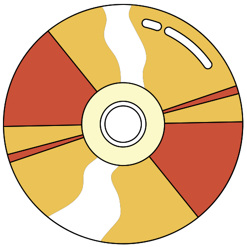
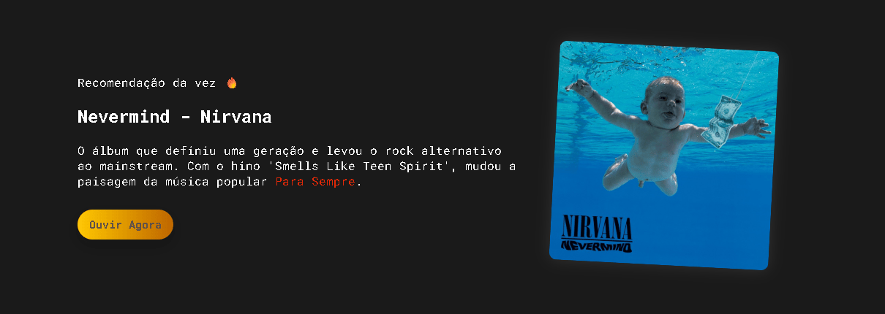

<h1 align="center">
  
  Ｄｉｓｃｏ Ａｐｐ
</h1>

<p align="center">
  <strong>Jukebox visual retrô: catálogo musical responsivo com busca inteligente.</strong>
</p>

<p align="center">
  <a href="#-sobre">Sobre</a>&nbsp;&nbsp;&nbsp;|&nbsp;&nbsp;&nbsp;
  <a href="#-funcionalidades">Funcionalidades</a>&nbsp;&nbsp;&nbsp;|&nbsp;&nbsp;&nbsp;
  <a href="#-tecnologias">Tecnologias</a>&nbsp;&nbsp;&nbsp;|&nbsp;&nbsp;&nbsp;
  <a href="#-preview">Preview</a>&nbsp;&nbsp;&nbsp;|&nbsp;&nbsp;&nbsp;
  <a href="#-como-acessar">Acessar</a>
</p>

<p align="center">
  
  
</p>

---

## 🎸 Sobre

O **Disco APP** é uma aplicação web desenvolvida durante a **Imersão Dev com Google Gemini** da Alura. 

O objetivo foi criar uma base de conhecimento interativa. Inspirado na estética de Jukeboxes antigas e lojas de vinil, o projeto vai além de uma lista simples, oferecendo uma experiência visual imersiva onde o usuário pode explorar discografias, conhecer detalhes de álbuns clássicos e receber recomendações.

## ✨ Funcionalidades

- **🔍 Busca Full-Text Inteligente:** Filtre álbuns não apenas pelo nome, mas também pelo artista, gênero ou palavras-chave na descrição.
- **🎲 Recomendação Aleatória:** Não sabe o que ouvir? A cada recarregamento da página (F5), o app sugere um álbum diferente na aba de "Recomendação da vez 🔥".
- **📱 Design Responsivo:** Layout fluido que se adapta perfeitamente a computadores, tablets e celulares.
- **🎨 UI/UX Retrô:** Efeitos de *hover* (mouse), sombras e tipografia pensados para remeter à estética musical clássica.
- **🔗 Integração:** Links diretos para ouvir o álbum no Spotify ou YouTube.

## 🚀 Tecnologias

Esse projeto foi desenvolvido utilizando as tecnologias fundamentais da Web, focando em semântica e performance:

- **HTML5:** Estruturação semântica do conteúdo.
- **CSS3:** Estilização avançada com Flexbox, Grid Layout e Variáveis CSS (Custom Properties).
- **JavaScript (ES6+):** Lógica de busca, manipulação do DOM e renderização dinâmica dos dados a partir de JSON.
- **IA (Google Gemini):** Utilizada como "Thought Partner" para geração de massa de dados, refinamento de CSS e lógica de busca.

## 📸 Preview

<div align="center">
  
</div>

## 🌐 Como Acessar

<div align="center">
Você pode acessar o projeto online clicando no botão abaixo:
<br><br>
<a href="https://ita-lodotexe.github.io/DiscoApp/" target="_blank">
  
</a>
</div>

## 🛠️ Como rodar localmente

1. Clone este repositório:
   ```bash
   git clone https://github.com/Ita-lodotexe/DiscoApp
   ```
